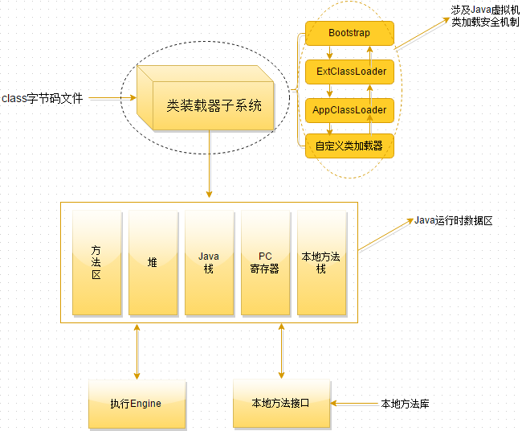

1. Java中修饰符一种有以下几种：
   1. 访问控制修饰符

      public、private、protected、缺省

   2. 其他修饰符

      abstract、final、static、native、synchronized、transient、volatile

   3. 对于形式参数只能用final修饰符，其他任何修饰符都会引起编译器错误，但是这个修饰符有一个限制就是，在方法中不能对参数做任何修改。

   4. final修饰符一般在方法内部类使用

2. 子类的构造方法总是优先调用父类的构造方法，如果子类的构造方法没有明显地指明使用父类的那个构造方法，默认使用无参构造方法，但如果傅雷没有无参的构造函数，所以子类需要在自己的构造函数中显示的调用父类的构造函数。

3. Java中的关键字是对Java的编译器有特殊的意义，他们用来表示一种数据类型，或者表示程序的结构，关键字不能用变量名、方法名、类名、包名和参数

   - 其中true、false是boolean的变量值，是编译器赋予特定含义的，但并不是关键字。

4. 静态域执行顺序

   1. 静态块：用static声明，JVM加载类时执行，仅执行一次
   2. 构造块：类中直接用{}定义，每一次创建对象时执行
   3. 执行顺序：静态块》main》构造块》构造方法
   4. 其中静态块只是静态域的一种
   5. 静态域中包含了静态变量、静态块、静态方法，其中需要初始化的是静态变量和静态块，而他们两个初始化顺序是靠他们俩的位置决定的。

5. 事务盲点

   1. Java程序只是设定事务的隔离级别
   2. Hibernate 是一个java的数据持久化框架，方便数据库的访问
   3. 事务隔离级别由数据库实现，是数据库系统本身的一个功能
   4. JDBC是java database connector，也就是java访问数据库的驱动
   5. 为了解决更新丢失、脏读、不可重读，定义了四个事务隔离级别分别为：未授权读取（read uncommitted）、授权读取（read committed）、可重复读取（repeatable read）、序列化（Serializable）

6. Java 包

   1.  提供了包机制，包是类的容器，用于分割类名空间。
   2. 如果没有指定包名，所有的示例都属于一个默认的无名包。
   3. `Java` 是跨平台的，所以Java中的包和操作系统没有任何关系。
   4. `Java`的包是用来组织文件的一种虚拟文件系统。
   5. `import` 语句并没有将对应的`java`源文件拷贝到此处，仅仅是引用，包塑编译器有使用外部文件，编译的时候去读取这个外部文件。
   6. 同一个包内的类可以不经过 `import` 而直接相互使用。

7. 类加载的初始化问题

   1. 虚拟机在首次加载java类时，会对静态初始化块、静态成员变量、静态方法进行一次初始化。
   2. 只有在调用new方法时才会创建类的实例。
   3. 类实例创建过程：按照父子集成关系进行初始化，首先执行父类的初始化块部分，然后是父类的构造方法，再执行本类集成的子类的初始化块，最后是子类的构造方法。
   4. 类实例销毁的时候，首先销毁子类部分，再销毁父类部分。
   5. 整体的加载顺序：父类静态代码块》子类静态代码块》父类普通代码块》父类构造方法》子类普通代码块》子类构造方法。

8. java 进程同步的两种方法：

   1. 同步块
   2. 同步方法
   3. 对于同步来说都是使用`synchronized`方法。
   4. 每一个对象都有一个监视器，也就是我们说的锁。

9. java 类型装换

   1. 代码示例：

      ```java
      byte b1=1,b2=2,b3,b6;
      final byte b4=4,b5=6;
      b6=b4+b5;
      b3 = b1 + b2;
      ```

   2. 被final修饰的变量是常量，这里的b6=b4+b5可以看成是b6=10，在编译时就已经变成b6=10了

   3. b1 和 b2 是 byte 类型，java中计算时将他们提升为int类型，再进行计算，计算后是int类型，赋值给b3，b3是byte类型，类型不匹配编译不会通过，需要进行强制转换。

   4. Java 表达式转型规则：由低到高

      1. 所有的byte、short、char 类型的值将被提升为 int 型
      2. 如果有一个操作数是long、float、double，计算结果就是对应的类型

   5. 被final修饰的变量不会自定改变类型，当2个final修饰相操作时，结果会根据左边变量的类型而转化。

10. java 类

  1. 一个文件可以有多个类，可以使并列的类，也可以是外部类、内部类结合。
  2. 一个类中，可以有多个main方法，这是重载，但是 psvm(String[] args) 的方法只能有一个。
  3. 在一个类中可以有main方法，也可以没有main方法，而有一个main方法的时候，也可以时候也，也可以是任一访问权限，因为这个类不一定要执行，可以只是辅助类。
  4. Java 程序的main方法必须卸载类里面
  5. Java 程序中可以有多个名字为 main 方法

11. Java 抽象类和接口的比较

    1. 抽象类可以有构造，只不过不能new。
    2. 接口中可以有变量，但是无论怎样写，最后都是psf。
    3. 抽闲类中可以有静态方法，接口中也可以有。
    4. 接口中可以有非抽象的方法，比如default方法。
    5. 接口中可以带有方法体的方法。
    6. 接口中的方法默认是public的。

12. Thread run 和 start

    1. 若调用 start 方法，则县整形主线程，后执行子线程。
    2. 若调用 run 方法，相当于函数调用，顺序执行。

13. Object getClass 和 getName

    1. ```
       super.getClass().getName()
       返回：包名+类名
       ```

    2. ```
       super.getClass()
       返回：class 包名+类名
       ```

14. String 的理解

    1. ```java
       public class StringDemo{
           private static final String MESSAGE="taobao";
           public static void main(String [] args) {
               String a ="tao"+"bao";
               String b="tao";
               String c="bao";
               System.out.println(a==MESSAGE);
               System.out.println((b+c)==MESSAGE);
           }
       }
       ```

    2. 解释：

       对于这道题，考察的是对String类型的认识以及编译器优化。Java中String不是基本类型，但是有些时候和基本类型差不多，如String b = "tao" ; 可以对变量直接赋值，而不用 new 一个对象（当然也可以用 new）。所以String这个类型值得好好研究下。

       Java中的变量和基本类型的值存放于栈内存，而new出来的对象本身存放于堆内存，指向对象的引用还是存放在栈内存。例如如下的代码：

       **int**  i=1;

           String s =  **new**  String( "Hello World" );

       变量i和s以及1存放在栈内存，而s指向的对象”Hello World”存放于堆内存。


    [](http://static.oschina.net/uploads/img/201305/28181619_ugB3.jpg)

 

       栈内存的一个特点是数据共享，这样设计是为了减小内存消耗，前面定义了i=1，i和1都在栈内存内，如果再定义一个j=1，此时将j放入栈内存，然后查找栈内存中是否有1，如果有则j指向1。如果再给j赋值2，则在栈内存中查找是否有2，如果没有就在栈内存中放一个2，然后j指向2。也就是如果常量在栈内存中，就将变量指向该常量，如果没有就在该栈内存增加一个该常量，并将变量指向该常量。
    
        [](http://static.oschina.net/uploads/img/201305/28181619_TJmL.jpg)
    
       如果j++，这时指向的变量并不会改变，而是在栈内寻找新的常量（比原来的常量大1），如果栈内存有则指向它，如果没有就在栈内存中加入此常量并将j指向它。这种基本类型之间比较大小和我们逻辑上判断大小是一致的。如定义i和j是都赋值1，则i==j结果为true。==用于判断两个变量指向的地址是否一样。i==j就是判断i指向的1和j指向的1是同一个吗？当然是了。对于直接赋值的字符串常量（如String s=“Hello World”；中的Hello World）也是存放在栈内存中，而new出来的字符串对象（即String对象）是存放在堆内存中。如果定义String s=“Hello World”和String w=“Hello World”，s==w吗？肯定是true，因为他们指向的是同一个Hello World。

 

       [](http://static.oschina.net/uploads/img/201305/28181619_E8BZ.jpg)

 

       堆内存没有数据共享的特点，前面定义的String s =  **new**  String( "Hello World" );后，变量s在栈内存内，Hello World 这个String对象在堆内存内。如果定义String w = **new**  String( "Hello World" );，则会在堆内存创建一个新的String对象，变量w存放在栈内存，w指向这个新的String对象。堆内存中不同对象（指同一类型的不同对象）的比较如果用==则结果肯定都是false，比如s==w？当然不等，s和w指向堆内存中不同的String对象。如果判断两个String对象相等呢？用equals方法。

 

 

       [](http://static.oschina.net/uploads/img/201305/28181619_uF6N.jpg)

 

       说了这么多只是说了这道题的铺垫知识，还没进入主题，下面分析这道题。 MESSAGE 成员变量及其指向的字符串常量肯定都是在栈内存里的，变量 a 运算完也是指向一个字符串“ taobao ”啊？是不是同一个呢？这涉及到编译器优化问题。对于字符串常量的相加，在编译时直接将字符串合并，而不是等到运行时再合并。也就是说
     
       String a =  "tao" + "bao" ;和String a =  "taobao" ;编译出的字节码是一样的。所以等到运行时，根据上面说的栈内存是数据共享原则，a和MESSAGE指向的是同一个字符串。而对于后面的(b+c)又是什么情况呢？b+c只能等到运行时才能判定是什么字符串，编译器不会优化，想想这也是有道理的，编译器怕你对b的值改变，所以编译器不会优化。运行时b+c计算出来的"taobao"和栈内存里已经有的"taobao"是一个吗？不是。b+c计算出来的"taobao"应该是放在堆内存中的String对象。这可以通过System. *out* .println( (b+c)== *MESSAGE* );的结果为false来证明这一点。如果计算出来的b+c也是在栈内存，那结果应该是true。Java对String的相加是通过StringBuffer实现的，先构造一个StringBuffer里面存放”tao”,然后调用append()方法追加”bao”，然后将值为”taobao”的StringBuffer转化成String对象。StringBuffer对象在堆内存中，那转换成的String对象理所应当的也是在堆内存中。下面改造一下这个语句System. *out* .println( (b+c).intern()== *MESSAGE* );结果是true， intern() 方法会先检查 String 池 ( 或者说成栈内存 ) 中是否存在相同的字符串常量，如果有就返回。所以 intern()返回的就是*MESSAGE*指向的"taobao"。再把变量b和c的定义改一下，
     
       ```java
       final  String b =  "tao" ;
     
       final  String c =  "bao" ;
     
       System. out .println( (b+c)== MESSAGE );
       ```
     
       现在b和c不可能再次赋值了，所以编译器将b+c编译成了”taobao”。因此，这时的结果是true。
     
       在字符串相加中，只要有一个是非final类型的变量，编译器就不会优化，因为这样的变量可能发生改变，所以编译器不可能将这样的变量替换成常量。例如将变量b的final去掉，结果又变成了false。这也就意味着会用到StringBuffer对象，计算的结果在堆内存中。
     
           如果对指向堆内存中的对象的String变量调用intern()会怎么样呢？实际上这个问题已经说过了，(b+c).intern()，b+c的结果就是在堆内存中。对于指向栈内存中字符串常量的变量调用intern()返回的还是它自己，没有多大意义。它会根据堆内存中对象的值，去查找String池中是否有相同的字符串，如果有就将变量指向这个string池中的变量。
     
       ```java
       String a = "tao"+"bao";
     
       String b = new String("taobao");
     
       System.out.println(a==MESSAGE); //true
     
       System.out.println(b==MESSAGE);  //false
     
       b = b.intern();
     
       System.out.println(b==MESSAGE); //true
     
       System. out .println(a==a.intern());  //true
     
       ```

java  类方法

1. 类方法是指类中被static修饰的方法，无this指针。
2. 可以将this理解为对象，而类方法属于类，不属于对象，所以类方法前不能加this指针。
3. 类方法示可以调用其他类的static方法的。
4. 可以在类中申请一个类对象或者参数穿第一个对象或者指针都可以调用。

对象互斥锁：

1. synchronized：给对象或者方法添加互斥锁，同一时间只能有一个对象或者方法执行这段代码
2. volatile：用来确保将变量的更新操作通知到其他线程，当把变量声明为valatile类型后，编译器与运行时都会注意到这个变量是共享的，因此不会将该变量上的操作与其他内存操作一起重排序，然而，在访问volatile变量时不会执行加锁操作，因此也就不会执行线程受阻塞，因此volatile变量是一种比synchhronized关键字更轻量级的同步机制
3. serialize：Java对象序列化为二进制
4. static：修饰变量、方法、静态代码块

Java 中声明变量的时候，如果使用的是包装类型，属于引用类型， `Byte x`。

又是一道类加载顺序：

```java
public class Base
{
    private String baseName = "base";
    public Base()
    {
        callName();
    }
 
    public void callName()
    {
        System. out. println(baseName);
    }
 
    static class Sub extends Base
    {
        private String baseName = "sub";
        public void callName()
        {
            System. out. println (baseName) ;
        }
    }
    public static void main(String[] args)
    {
        Base b = new Sub();
    }
}
```

1. 子类覆盖父类方法，是方法重写实现多态问题
2. Base b = new Sub(); 它为多态的一种表现方式，声明是Base，实现是 Sub类，可以理解为 b 编译时表现为Base类特性，运行时表现为Sub特性
3. 当子类覆盖了父类的方法后，意思是父类的方法已经被重写，体重父类初始化调用的方法为子类实现的方法，子类实现的方法中调用了baseName 为子类中的的私有属性。
4. 当执行到父类构造函数，子类非静态代码块和初始化步骤还没有到，子类中的baseName还没有被初始化，所以baseName为空。

Java 标识符

1. 标识符由26个英文字符大小写、数字、下划线和美元符号组成
2. 不能以数字开头，不能是关键字
3. 严格区分大小写
4. 标识符可以为任意长度

Java 支持的语言类型

1. 基本类型包括boolean类型和数值类型，
   1. 数值类型分为整型和浮点类型，
   2. 整型包括：byte、char、short、int、long。
   3. 浮点型：float和double
2. 引用类型包括类、接口和数组
3. Byte和Float数据基本类型的包装类型，属于引用类型。

Jsp 内置对象

1. 关于 `Exception`，当 `isErrorPage="false"`，用`errorPage=“error.jsp”`（isErrorPage默认是false）
2. 当`isErrorPage=“true”`,页面会直接使用`exception`

类方法

1. 在类方法中调用本类的类方法时可以直接调用。
2. 在类方法中可以通过创建实例对象调用类的实例方法。

forward 和 redirect 区别

1. 从地址栏显示来说

- forward是服务器请求资源,服务器直接访问目标地址的URL,把那个URL的响应内容读取过来,然后把这些内容再发给浏览器.浏览器根本不知道服务器发送的内容从哪里来的,所以它的地址栏还是原来的地址.


- redirect是服务端根据逻辑,发送一个状态码,告诉浏览器重新去请求那个地址.所以地址栏显示的是新的URL.


2. 从数据共享来说

- forward:转发页面和转发到的页面可以共享request里面的数据.


- redirect:不能共享数据.


3. 从运用地方来说

- forward:一般用于用户登陆的时候,根据角色转发到相应的模块.


- redirect:一般用于用户注销登陆时返回主页面和跳转到其它的网站等.


4. 从效率来说

- forward:高.


- redirect:低.

  redirect 默认是302码，包含两次请求和两次响应。

对于赋值转化

1. intValue 是把 Integer 对象编程 int 的基础数据类型
2. parsenInt 是把 String 变成 int 的基础数据类型
3. ValueOf 是把 String 转化成 Integer 对象类型

equals 和 ==

1. == 比较的是两个变量的值是否相等

2. 对于引用型变量表示的是两个变量在堆中存储的的地址是否相同，即栈中的内容是否相同

3. ```java
   public static boolean isAdmin(String userId){
       return userId.toLowerCase()=="admin";
   }
   ```

4. 源码中 toLowerCase 是重新  `new String(result, 0, len+resultoffset)`  是一个新对象，不相等

内部类

1. 非静态内部类

2. 静态内部类

3. ```java
   public class Enclosingone {
       //非静态内部类
       public class InsideOne {}
       //静态内部类
       public static class InsideTwo{}
   }
 
   class Mytest02{
       public static void main(String args []){
           Enclosingone.InsideOne obj1 = new Enclosingone().new InsideOne();//非静态内部类对象
           Enclosingone.InsideTwo obj2 = new Enclosingone.InsideTwo();//静态内部类对象
       }
   }
   ```

4. 1.为什么使用内部类?

   使用内部类最吸引人的原因是：每个内部类都能独立地继承一个（接口的）实现，所以无论外围类是否已经继承了某个（接口的）实现，

   对于内部类都没有影响

   1.1.使用内部类最大的优点就在于它能够非常好的解决多重继承的问题,使用内部类还能够为我们带来如下特性:

   (1)、内部类可以用多个实例，每个实例都有自己的状态信息，并且与其他外围对象的信息相互独。

   (2)、在单个外围类中，可以让多个内部类以不同的方式实现同一个接口，或者继承同一个类。

   (3)、创建内部类对象的时刻并不依赖于外围类对象的创建。

   (4)、内部类并没有令人迷惑的“is-a”关系，他就是一个独立的实体。

   (5)、内部类提供了更好的封装，除了该外围类，其他类都不能访问。

   2.内部类分类:

   (一).成员内部类:

   ```java
   public class Outer{
       private int age = 99;
       String name = "Coco";
       public class Inner{
           String name = "Jayden";
           public void show(){
               System.out.println(Outer.this.name);
               System.out.println(name);
               System.out.println(age);
           }
       }
       public Inner getInnerClass(){
           return new Inner();
       }
       public static void main(String[] args){
           Outer o = new Outer();
           Inner in = o.new Inner();
           in.show();
       }
   }
   ```

   1.Inner 类定义在 Outer 类的内部，相当于 Outer 类的一个成员变量的位置，Inner 类可以使用任意访问控制符，

   如 public 、 protected 、 private 等

   2.Inner 类中定义的 show() 方法可以直接访问 Outer 类中的数据，而不受访问控制符的影响，

   如直接访问 Outer 类中的私有属性age

   3.定义了成员内部类后，必须使用外部类对象来创建内部类对象，而不能直接去 new 一个内部类对象，

   即：内部类 对象名 = 外部类对象.new 内部类( );

   4.编译上面的程序后，会发现产生了两个 .class 文件: Outer.class,Outer$Inner.class{}

   5.成员内部类中不能存在任何 static 的变量和方法,可以定义常量:

   (1).因为非静态内部类是要依赖于外部类的实例,而静态变量和方法是不依赖于对象的,仅与类相关,

   简而言之:在加载静态域时,根本没有外部类,所在在非静态内部类中不能定义静态域或方法,编译不通过;

   非静态内部类的作用域是实例级别

   (2).常量是在编译器就确定的,放到所谓的常量池了

   ★★友情提示:

   1.外部类是不能直接使用内部类的成员和方法的，可先创建内部类的对象，然后通过内部类的对象来访问其成员变量和方法;

   2.如果外部类和内部类具有相同的成员变量或方法，内部类默认访问自己的成员变量或方法，如果要访问外部类的成员变量，

   可以使用 this 关键字,如:Outer.this.name

   (二).静态内部类: 是 static 修饰的内部类,

   1.静态内部类不能直接访问外部类的非静态成员，但可以通过 new 外部类().成员 的方式访问

   2.如果外部类的静态成员与内部类的成员名称相同，可通过“类名.静态成员”访问外部类的静态成员；

   如果外部类的静态成员与内部类的成员名称不相同，则可通过“成员名”直接调用外部类的静态成员

   3.创建静态内部类的对象时，不需要外部类的对象，可以直接创建 内部类 对象名 = new 内部类();

   ```java
   public class Outer{
       private int age = 99;
       static String name = "Coco";
       public static class Inner{
           String name = "Jayden";
           public void show(){
               System.out.println(Outer.name);
               System.out.println(name);       
           }
       }
       public static void main(String[] args){
           Inner i = new Inner();
           i.show();
       }
   }
   ```

   (三).方法内部类：其作用域仅限于方法内，方法外部无法访问该内部类

   (1).局部内部类就像是方法里面的一个局部变量一样，是不能有 public、protected、private 以及 static 修饰符的

   (2).只能访问方法中定义的 final 类型的局部变量,因为:

   当方法被调用运行完毕之后，局部变量就已消亡了。但内部类对象可能还存在,

   直到没有被引用时才会消亡。此时就会出现一种情况，就是内部类要访问一个不存在的局部变量;

   ==>使用final修饰符不仅会保持对象的引用不会改变,而且编译器还会持续维护这个对象在回调方法中的生命周期.

   局部内部类并不是直接调用方法传进来的参数，而是内部类将传进来的参数通过自己的构造器备份到了自己的内部，

   自己内部的方法调用的实际是自己的属性而不是外部类方法的参数;

   防止被篡改数据,而导致内部类得到的值不一致

   ```java
   /*
           使用的形参为何要为 final???
            在内部类中的属性和外部方法的参数两者从外表上看是同一个东西，但实际上却不是，所以他们两者是可以任意变化的，
            也就是说在内部类中我对属性的改变并不会影响到外部的形参，而然这从程序员的角度来看这是不可行的，
            毕竟站在程序的角度来看这两个根本就是同一个，如果内部类该变了，而外部方法的形参却没有改变这是难以理解
            和不可接受的，所以为了保持参数的一致性，就规定使用 final 来避免形参的不改变
            */
   public class Outer{
       public void Show(){
           final int a = 25;
           int b = 13;
           class Inner{
               int c = 2;
               public void print(){
                   System.out.println("访问外部类:" + a);
                   System.out.println("访问内部类:" + c);
               }
           }
           Inner i = new Inner();
           i.print();
       }
       public static void main(String[] args){
           Outer o = new Outer();
           o.show();
       }
   }
   ```

   **(3).注意:在JDK8版本之中,方法内部类中调用方法中的局部变量,可以不需要修饰为 final,匿名内部类也是一样的，主要是JDK8之后增加了 Effectively final 功能**

   [**http://docs.oracle.com/javase/tutorial/java/javaOO/localclasses.html**](http://docs.oracle.com/javase/tutorial/java/javaOO/localclasses.html)

   **反编译jdk8编译之后的class文件,发现内部类引用外部的局部变量都是 final 修饰的**

   (四).匿名内部类:

   (1).匿名内部类是直接使用 new 来生成一个对象的引用;

   (2).对于匿名内部类的使用它是存在一个缺陷的，就是它仅能被使用一次，创建匿名内部类时它会立即创建一个该类的实例，

   该类的定义会立即消失，所以匿名内部类是不能够被重复使用;

   (3).使用匿名内部类时，我们必须是继承一个类或者实现一个接口，但是两者不可兼得，同时也只能继承一个类或者实现一个接口;

   (4).匿名内部类中是不能定义构造函数的,匿名内部类中不能存在任何的静态成员变量和静态方法;

   (5).匿名内部类中不能存在任何的静态成员变量和静态方法,匿名内部类不能是抽象的,它必须要实现继承的类或者实现的接口的所有抽象方法

   (6).匿名内部类初始化:使用构造代码块！利用构造代码块能够达到为匿名内部类创建一个构造器的效果

   ```java
   public class OuterClass {
       public InnerClass getInnerClass(final int   num,String str2){
           return new InnerClass(){
               int number = num + 3;
               public int getNumber(){
                   return number;
               }
           };        /* 注意：分号不能省 */
       }
       public static void main(String[] args) {
           OuterClass out = new OuterClass();
           InnerClass inner = out.getInnerClass(2, "chenssy");
           System.out.println(inner.getNumber());
       }
   }
   interface InnerClass {
       int getNumber();
   }
   ```

Hibernate 使用的七大措施

1. 尽量使用many-to-one，避免使用单项one-to-many
2. 灵活使用单项 one-to-many
3. 不用一对一，使用多对一替代一对一
4. 配置对象缓存，不使用集合缓存
5. 一对多使用Bag，多对一使用Set
6. 继承使用显示多态HQL：from object asf = “exlicit” 避免到处查所有对象
7. 消除大表，使用二级缓存

Throwable

1. Error
2. Exception
   1. IOException
   2. Runtime Exception

静态变量只能在类主体中定义，不能再方法中定义。

1. 静态变量属于类所有而不属于方法

继承加载顺序

1. ```java
   Base b = new Sub();
   ```

2. 多态的一种表现形式，声明是 Base，实现是Sub 类，理解为 b 编译时表现为 Base 类特性，运行时表现为 Sub 类特性。

3. 当子类覆盖了父类的方法后，意思是父类的方法已经被重写，父类初始化调用的方法为子类实现的方法，子类实现的方法中调用的 baseName 为子类中的私有属性。

Volatile 关键字

1. 一旦一个共享变量（类的成员变量、类的静态成员变量）被 volatile 修饰后
2. 保证了不同线程对该变量进行操作时的可见性，即一个线程修改了某个变量的值，这个值对于其他的线程来说是立即可见的
3. 禁止进行指令重排序
4. volatile 只提供了保证访问该变量时，每次都是从内存中读取最新值，并不会使用寄存器缓存该值。
5. 每次都从内存中读取，而对该变量的修改，volatile 并不提供原子性的保证
6. 由于及时更新，很可能导致另一线程访问最新变量值，无法跳出循环，多线程下计数器必须使用锁保护。

getMethods 和 getDeclaredMethods 的区别

1. getMethods：返回某个类的所有public 方法包括其继承类的公用方法，当然包括他所实现接口的方法。
2. getDeclaredMethods：标识类或接口声明的所有的方法，包括公共，保护、默认访问、私有方法，但不包括继承的方法，当然也包括它所实现接口的方法。

url 本身的原因，把`{}` 的内容当成了占位符，而这里没有明确说明占位符对应的值，所以会导致报错

```java
String json = {"\"name\":\"jack\",\"age\":18"};
String url = "http://localhost:8080/search?people={json}";
String email = restTemplate.getForObject(url, String.class, json);
```
对于Application，主线程 main() 方法执行的线索，对于  applet  主线程是主线程加载并执行java小程序

java 类是单继承，java 接口是多继承，不允许类多重继承的主要原因是：如果A同事继承B和C，而B和C同事又有一个D方法，A 就不知如何继承那个了，但是对于接口全是抽象方法，就可以多继承。

依赖注入和控制反转（同一个概念，但有不同的侧重点）

1. 依赖注入：从应用程序的角度描述，可以把依赖注入描述完整点，应用程序依赖容器创建并注入他所需要的外部资源。
2. 控制反转：从容器的角度来描述，容器控制应用程序，由容器反向的向应用程序注入应用程序所需的外部资源。

java 正则表达式

1. ```java
   "com.jd.". replaceAll(".", "/") + "MyClass.class"
   ```

2. `.` 在正则表达式中标识任何字符，所以会把前面字符串的所有字符都替换成 `/` 。

3. 正则规则：

   1. .表示除\n之外的任意字符
   2. *表示匹配0-无穷
   3. +表示匹配1-无穷
   4. (?=Expression) 顺序环视，(?=\\()就是匹配正括号

java 常识

1. JDK5之后，J2SDK该名为 Java SE JDK，它是java开发编程的工具，提供了编译功能和运行环境
2. appletviewer.exe 执行选项参数并没有jar选项
3. appletviewwer（小程序浏览器），是一种执行HTML文件上的Java小程序类的java浏览器，就是用来解释java applet 应用程序的，不需要写main函数。

Java 运算符的计算顺序

1. > 顺序： 括号>单元操作符>算术运算符>移位操作符>关系运算符>位运算符>逻辑运算符>三元操作符>赋值运算符

2. 单目运算符：+，-，++，--

   算数运算符：+，-，*，/，%

   移位运算符：<<,>>

   关系运算符：>,<,>=,<=,==,!=

   位运算符：&，|，~，^,

   逻辑运算符：&&，||

   三目运算符：表达式1？表达式2：表达式3;

   赋值运算符：=等

3. 特别容易混淆的符号：

   1. `<<`  表示左移位
   2. `>>`  表示右移位
   3. `>>>`  表示无符号右移
   4. 但是没有 `<<<` 运算符

Java 命令

1. java是运行指令：java 程序的名字但是不加后缀
2. javac 是编译命令：后面跟的java程序名字要加后缀


1. == 比较的是地址，但是当为基本类型时，比较的就是值
2. 如果两边有包装类型，则现将包装类型装换为基本类型，再进行比较是否相等
3. 如果两边都为包装类，即为对象，比较的就是地址

finally 在 try-catch 语句中，一定会执行

1. finally 中有return语句，当try执行到return时会执行finally中的代码其中有return就直接返回了。

2. 栗子：

   ```java
   public static int func (){
       try{
           return 1;
       }catch (Exception e){
           return 2;
       }finally{
           return 3;
       }
   }
   ```

3. finally 中不含return语句，那么当执行return时，它会被保存等待finally执行完毕后返回，但是这个时候无论finally内部如何改变这个值，都不会影响返回结果。

4. 栗子：

   ```java
   public static int func1(){
       int i = 0 ;
       int test(){
           try {
               return i;
           } catch (Exception e) {
               return -1;
           }finally{
               i++;
           }
       }
   }
   ```

算法包括0个或多个输入，一个或多个输出，中间有穷个处理过程

1. 存储结构不属于算法结构
2. 算法的五个特性：
   1. 有穷性：必须能在有限个步骤之后终止
   2. 确定性：每一步骤必须有确切的定义
   3. 输入项：一个算法有0个或多个输入，以刻画运算对象的初始情况，所谓0个输入是指算法本身指定了初始条件。
   4. 输出项：一个算法有一个或多个输出，以反映对输入数据加工后的结果，没有输出的算法毫无意义。
   5. 可行性：算法中执行的任何计算步骤都是可以被分解为基本的可执行的操作步骤，即每个计算都可以在有限时间内完成

Tomcat 为每个 App 创建一个 Loader，里面保存着此 、WebApp 的 ClassLoader，需要加载WebApp下的类时，就取出ClassLoader来使用。

在switch(exp1) 中，exp1 只能是一个整数表达式或者枚举常量

1. 整数表达式可以是 int 基本类型或 Integer 包装类型，由于 byte，short，char 都可以隐含装换为 int ，所以这些类型以及这些类型的包装类型也是可以的
2. 显然，long、float、double 类型都不符合switch的语法规定，并且不能被隐式转换成int类型
3. String 类型是 Java 7 开始支持的

实现接口，就要实现接口里面的所有方法，相当于重写，重写需要满足：（三同一大一小）

1. 方法名相同
2. 返回值相同
3. 形参相同
4. 访问权限大于等于重写前
5. 抛出异常小于等于重写前
6. 接口时隐式抽象的，当声明一个接口的时候，不必使用abstract关键字
7. 接口中每个方法也是隐式抽象的，声明时同样不需要abstract关键字
8. 接口中的方法都是共有的

泛型仅仅是java语法糖，他不会影响java虚拟机生成的汇编代码，在编译阶段，虚拟机就会把泛型的类型擦除，还原成没有泛型的代码，顶多编译速度稍微慢一些，执行速度是完全没有什么影响的。

1. 泛型只是在编译的时候保证数据类型的正确性，和运行期间的性能无关

类 、内部类、局部内部类

1. 类：只能使用public、default、abstract（此类只能被继承）、final（标识此类不能被继承）修饰。
2. 内部类：和成员变量一样可以用所有访问权限修饰符修饰。
3. 局部内部类：和局部变量一样不能用访问权限修饰符修饰。

java.io.PrintWriter：用来创建一个文件并向文本文件写入数据

1. 栗子：

   ```java
   public static void main(String[] args) throws FileNotFoundException{
       File file=new File("num.txt");//文件对象
       if(file.exists()){
           System.out.print("文件已经存在！");
           System.exit(0);
       }
       PrintWriter out=new PrintWriter(file);//由文件对象构造一个写出器
       out.println("John,Where are you?");
       out.println("I'am here!");
       out.println("How old are you?");
       out.println(15);
       //关闭写出器
       out.close();
   }
   ```

ServletContext 和 ServletConfig 的区别

1. ServletContext：Servlet 容器在启动时会加载web应用，并为每个web应用创建唯一的Servlet Context 对象，可以把 ServletContext 看成是一个 Web应用的服务器端组件的共享内存，在ServletContext中可以存放共享数据 。ServletContext 对象是一个真正的全局对象，凡是 web容器中的`Servlet`都可以访问。
2. 整个Web应用只有唯一的一个ServletContext对象。
3. ServletConfig对象：用于封装Servlet的配置信息，从一个Servlet被实例化后，对任何客户端在任何时候访问有效，但仅对Servlet自身有效，一个Servlet的ServletConfig对象不能被另一个Servlet访问。

Servlet 和 CGI 的比较

1. 当用户浏览器发出一个Http/CGI 的请求，或者调用一个CGI程序的时候，服务器端就要启用一个线程（而且每次都要调用），调用CGI程序越多，就要消耗系统越多的处理时间，对于高并发显然，鸡肋，对比Servlet就是每次调用时，会启动线程，这样可以充分利用系统资源。
2. 传统的CGI程序，不具备平台无关特性，系统环境发生变化，CGI程序就要瘫痪，而 Servlet 具备Java的平台无关性，在系统开发过程中保持了系统的扩展性和高效性。
3. 对于数据库层面也是，Servlet 有连接池的概念，可以利用多线程的优点，在系统缓存中事先建立好若干链接。

子类的构造方法总是先调用父类的构造方法，如果子类的构造方法没有明显地指明使用父类的那个构造方法，子类就调用父类不带参数的构造方法，

1. 父类没有无参的构造函数，所以子类需要在自己的构造函数中显示的调用父类的构造函数。

能够进行对象传输的是：`ObjectOutputStream` 和 `ObjectInputStream`

在包装类中，对 `equals` 方法重写，会先用 `instanceof` 比较是否属于该类，如果不属于，直接返回 `false`

1. `Integer` 栗子：

   ```java
   public boolean equals(Object obj) {
       if (obj instanceof Integer) {
           return value == ((Integer)obj).intValue();
       }
       return false;
   }
   ```

抽象类的小抄：

1. 抽象类不能被实例化，实例化的工作应该交由他的子类完成，他只需要一个引用即可。
2. 抽象方法必须由子类来进行重写
3. 只要包含一个抽象方法的类，该类必须要定义成抽象类，不管是否包含其他方法
4. 抽象类可以包含具体的方法，当然也可以不包含抽象方法
5. abstract 不能与 final 并列修饰同一个类
6. abstract 不能与private、static、final 或 native 并列修饰同一个方法。

静态方法的理解

1. 类对方法的调用，不是对象方法的调用
2. static 静态方法，直接使用“类.方法”即可，因为静态方法使用不依赖对象是否创建
3. null 可以被强制类型装换成任意类型，注意不是任意类型对象，因此可以通过它来执行静态方法
4. 非静态的方法，必须依赖对象被创建后才能使用

java 不允许单独的方法，过程或者函数存在，必须要隶属于某一个类中

1. java 语言中的方法属于对象的成员，而不是类的成员，不过，其中静态方法属于类的成员。

java 引用理解

1. 只要是引用传递，对引用的修改直接影响着原对象 （:x:）
2. 只有对应用对象的内部做了修改，才会影响原对象
3. 如果直接将引用修改了，则对原对象没有影响，唯一的影响是：这个被修改的引用，现在不是原来对象的引用，二是新对象的引用。
4. 引用传递指的是传递的时候，传递的是对象的运用，如果对引用的内部成员进行操作，则会直接影响到原对象，但是如果直接把此引用指向了其他对象，那么对不起，这个引用从此以后，便于之前的对象没有任何关系，当前代表仅仅是新指向的对象。

#### full GC触发的条件

除直接调用System.gc外，触发Full GC执行的情况有如下四种。

1. ##### 旧生代空间不足

  旧生代空间只有在新生代对象转入及创建为大对象、大数组时才会出现不足的现象，当执行Full GC后空间仍然不足，则抛出如下错误：
  java.lang.OutOfMemoryError: Java heap space
  为避免以上两种状况引起的FullGC，调优时应尽量做到让对象在Minor GC阶段被回收、让对象在新生代多存活一段时间及不要创建过大的对象及数组。

2. ##### Permanet Generation空间满

  PermanetGeneration中存放的为一些class的信息等，当系统中要加载的类、反射的类和调用的方法较多时，Permanet Generation可能会被占满，在未配置为采用CMS GC的情况下会执行Full GC。如果经过Full GC仍然回收不了，那么JVM会抛出如下错误信息：
  java.lang.OutOfMemoryError: PermGen space
  为避免Perm Gen占满造成Full GC现象，可采用的方法为增大Perm Gen空间或转为使用CMS GC。

3. ##### CMS GC时出现promotion failed和concurrent mode failure

  对于采用CMS进行旧生代GC的程序而言，尤其要注意GC日志中是否有promotion failed和concurrent mode failure两种状况，当这两种状况出现时可能会触发Full GC。
  promotion failed 是在进行Minor GC时，survivor space放不下、对象只能放入旧生代，而此时旧生代也放不下造成的；

  concurrent mode failure 是在执行CMS GC的过程中同时有对象要放入旧生代，而此时旧生代空间不足造成的。
  应对措施为：增大survivorspace、旧生代空间或调低触发并发GC的比率，但在JDK 5.0+、6.0+的版本中有可能会由于JDK的bug29导致CMS在remark完毕后很久才触发sweeping动作。对于这种状况，可通过设置-XX:CMSMaxAbortablePrecleanTime=5（单位为ms）来避免。

4. ##### 统计得到的Minor GC晋升到旧生代的平均大小大于旧生代的剩余空间

  这是一个较为复杂的触发情况，Hotspot为了避免由于新生代对象晋升到旧生代导致旧生代空间不足的现象，在进行Minor GC时，做了一个判断，如果之前统计所得到的Minor GC晋升到旧生代的平均大小大于旧生代的剩余空间，那么就直接触发Full GC。
  例如程序第一次触发MinorGC后，有6MB的对象晋升到旧生代，那么当下一次Minor GC发生时，首先检查旧生代的剩余空间是否大于6MB，如果小于6MB，则执行Full GC。
  当新生代采用PSGC时，方式稍有不同，PS GC是在Minor GC后也会检查，例如上面的例子中第一次Minor GC后，PS GC会检查此时旧生代的剩余空间是否大于6MB，如小于，则触发对旧生代的回收。
  除了以上4种状况外，对于使用RMI来进行RPC或管理的Sun JDK应用而言，默认情况下会一小时执行一次Full GC。可通过在启动时通过- java-Dsun.rmi.dgc.client.gcInterval=3600000来设置Full GC执行的间隔时间或通过-XX:+ DisableExplicitGC来禁止RMI调用System.gc。

java 访问权限

1. java的访问权限有 public、protected、private、default的，default 不能修饰变量
2. 普通变量不能用abstract修饰，abstract一般修饰方法和类
3. native：修饰的方法简单来说就是：一个Java方法调用了一个非Java代码的接口
4. 定义native方法时，并不提供实现类，因为其实现体是用非Java语言在外面实现的
5. native 可以和任何修饰符连用，abstract除外，因为native暗示这个方法有实现体，而abstract却显示指明了这个方法没有实现体。

Java 加载驱动方法

1. Class.forName("com.mysql.jdbc.Driver()")
2. DriverManager.registerDriver("com.mysql.jdbc.Driver()")
3. System.setProperty("jdbc.drivers","com.mysql.jdbc.Driver()")

MySQL 索引

1. 
2. MySQL 组合索引（复合索引）的最左优先原则，最左优先原则就是说组合索引的第一个字段必须出现在查询组句中，这个索引才会被用到。
3. 只要组合索引最左边第一个字段出现在Where中，那么不管后面的字段出现顺序如何，MySQL引擎都会自动调用索引来优化查询效率
4. 最左匹配原则可以知道B-Tree建立索引的过程，比如假设有一个3列索引（col1,col2,col3）,那么MySQL只会建立三个索引(col1)、（col1，col2）、（col1，col2，col3）
5. 最后总结就是，带头大哥不能死，中间兄弟不能断

java 异常

- Java 异常分为运行时异常和非运行异常也叫检查式异常
- 运行时异常：
  - ClassCastException
  - ClassNotFoundException
  - IndexOutOfBoundsException
  - NullPointerException
  - ArrayStoreException
  - BufferOverflowException
- 检查异常
  - IOException
  - SQLException

Byte 在内存中占一个字节，范围是 -128 到 127  之间，将128 强制类型转换为 byte 型，就超出了byte型的范围，128  的二进制存储是 1000 0000 转换为 byte 型后，最高位时符号位，值是 -128。

#### java 基本类型默认值

| 默认值  | 存储需求（字节） | 取值范围 | 示例         |                    |
| ------- | ---------------- | -------- | ------------ | ------------------ |
| byte    | 0                | 1        | -2^7—2^7-1   | byte b=10;         |
| char    | ‘ \u0000′        | 2        | 0—2^16-1     | char c=’c’ ;       |
| short   | 0                | 2        | -2^15—2^15-1 | short s=10;        |
| int     | 0                | 4        | -2^31—2^31-1 | int i=10;          |
| long    | 0                | 8        | -2^63—2^63-1 | long o=10L;        |
| float   | 0.0f             | 4        | -2^31—2^31-1 | float f=10.0F      |
| double  | 0.0d             | 8        | -2^63—2^63-1 | double d=10.0;     |
| boolean | false            | 1        | true\false   | boolean flag=true; |

- 注意其中的 char 为 无符号类型，char 和  short 的标识范围相同，都是两个字节。

#### JVM 区域划分

- 方法区在 JVM 中也是一个非常重要的区域，它与堆一样，是被线程共享的区域，在方法区中，存储了每个类的信息（包括类的名称、方法信息、字段信息）、静态变量、常量以及编译器变异后的代码。
- JVM 初始运行的时候都会分配好 Method Area（方法区）和 堆（Heap） ，而 JVM 每遇到一个线程，就为其分配一个 Program Counter Register（程序计数器）、VM Stack（虚拟机栈）、Native Method Stack （本地方法栈），当线程终止时，三者所占用的内存空间也会被释放掉，这也就是为什么我们把内存分为线程共享和非线程共享的原因，非线程共享的那三个区域的生命周期与所属于线程相同，而线程共享的内存的区域与 Java 程序运行的生命周期相同，所以这也是系统垃圾回收的场所发生在线程共享的区域的原因。

#### 父子类类型转换

- 向上转型，父类的引用无法访问子类独有的方法。

#### 字符使用单引号、字符串使用双引号

#### 流程控制语句

- 顺序结构：
- 选择结构：if、switch
- 循环结构：while、for

#### Java 中的原始类型就是基本类型，基本类型就是那 8 种，其余的起开。

#### final 用于定义常量、而 const 是 c  和  c++ 中使用的。

#### Java 静态代码块

- 无法直接调用静态初始化块
- 在创建第一个实例前或任何静态成员之前，将自动调用静态初始化块来初始化
- 静态初始化块既没有访问修饰符，也没有参数

#### Java  作用域

作用域         当前类          同一package           子孙类                其他package

public                √                    √                           √                             √

protected         √                    √                            √                            ×

defalt                 √                    √                            ×                            ×

private              √                     ×                            ×                             ×


 

JRE 判断一个程序是否执行完是通过所有的前台线程是否执行完毕。

JSP页面可以后缀可以使用 xxx.jsp

------

对于静态代码块和静态变量的定义：

- 两者可以同名，跟声明位置没有关系
- 即使两者名称相同，起作用的是 静态变量
- 内部声明和外部的作用域不同

------

#### 继承问题深入：

一般父类和子类的继承关系， `Super subToSuper = new Sub();` 出现这种情况，一般要是子类重写父类方法，则就是访问子类的方法，但是特殊情况是：若父类的是静态方法则不能被珍惜类重写，而是被隐藏，子类只能是继承父类的静态方法。对于此问题还得补充一条就是，对于非静态的变量父子类同事存在的时候，当然是调用父类的了，只有方法才有子类的份，有点惨。

```
结论是：静态属性和静态方法只是可以继承没有表现出多态性。
因为静态方法和静态属性没有采用动态绑定。具体表现就是，
将子类实例向上转型则会调用到基类中的静态方法和属性，
不转型就调用子类自身的静态方法和属性。
编译器不推荐通过实例去调用静态方法和属性，因为这种调用方式容易造成混淆。

实际上，在Java的规范中，Java对于类的方法和属性采用了两种完全不同的处理机制：
对于方法，使用重载机制实现了多态性；对于属性，使用的是同名属性隐藏机制。
所谓的同名属性隐藏机制是指：在具有父子关系的两个类中，
子类中相同名字的属性会使得从父类中继承过来的同名属性变得不可见，
不管类型是否一致，名称一致的两个属性就是同名属性。
在子类中，无法简单地通过属性名称来获取父类中的属性，
而是必须通过父类名称加属性名称(super.变量名)的方法才可以访问父类中的该属性。
一般而言，为了代码容易阅读，极其不建议在父类和子类中使用同名属性。
```

------

`Byte`  是 `byte` 的包装类型，初始化为 `null`  不是  `0`。

包装类就是不一般。

```java
public class Test0413 {
    int a = (int)8846.0;
    static Integer aa;
    static Byte bb;
    static Character cc;
    public static void main(String[] args) {
        System.out.println(aa);
        System.out.println(bb);
        System.out.println(cc);
    }
}
结果：
null
null
null
```

------

锁机制：

最基本的原则：原子性和可见性

原子性：某一时刻，同一段代码只有一个线程执行，防止冲突。

可见性：释放锁之前对于共享数据做出的更改对于随后获得该锁的另一个线程是可见的

原理：当对象获取锁之前，首先将自己的高速缓存无效，从主内存中装入变量，结束时，同步数据主内存更新。

某些情况可以不必同步：

- 由静态初始化器（在静态字段上或 static 块中的初始化器）
- 初始化数据时
- 访问 `final` 时
- 在创建线程之前，创建对象时
- 线程可以看见他将要处理的对象

synchronized 不足：

- 无法中断一个正在等候获得锁的线程
- 无法通过投票获得锁，如果不想等下去，也就没有办法获得锁
- 同步还要求锁的释放只能在与获得锁所在的堆栈相同的堆栈帧中进行

ReentrantLock：

- `java.util.concurrent.lock` 是 Java 中 Lock 框架锁定的一个抽象
- `ReentrantLock` 类实现了 Lock ，他拥有与 synchronized 相同的并发性和内存语义，添加了类似 锁投票、定时锁等候、可中断锁等候。
- 为了保证锁最终被释放，要把互斥区放入 try 中，释放锁放在 finally 中。

```java
class ReentrantLockDemo {    
    private Lock lock = new ReentrantLock();// 锁对象    

    public void output(String name) {           
        lock.lock();      // 得到锁    

        try {    
            for(int i = 0; i < name.length(); i++) {    
                System.out.print(name.charAt(i));    
            }    
        } finally {    
            lock.unlock();// 释放锁    
        }    
    }    
}  
```

Condition：

- Condition 用 `await()` 替换 `wait()`，用 `signal()` 替换 `notify()`，用 `signalAll()` 替换 `notifyAll()`
- Condition 绑定到 Lock 上，需要创建一个 Lock 的 Condition 必须用 `new  Condition()`

```java
class ReentrantLockDemo {  
    final Lock lock = new ReentrantLock();          //锁对象  
    final Condition notFull  = lock.newCondition(); //写线程锁  
    final Condition notEmpty = lock.newCondition(); //读线程锁  

    final Object[] items = new Object[100];//缓存队列  
    int putptr;  //写索引  
    int takeptr; //读索引  
    int count;   //队列中数据数目  

    //写  
    public void put(Object x) throws InterruptedException {  
        lock.lock(); //锁定  
        try {  
            // 如果队列满，则阻塞<写线程>  
            while (count == items.length) {  
                notFull.await();   
            }  
            // 写入队列，并更新写索引  
            items[putptr] = x;   
            if (++putptr == items.length) putptr = 0;   
            ++count;  

            // 唤醒<读线程>  
            notEmpty.signal();   
        } finally {   
            lock.unlock();//解除锁定   
        }   
    }  

    //读   
    public Object take() throws InterruptedException {   
        lock.lock(); //锁定   
        try {  
            // 如果队列空，则阻塞<读线程>  
            while (count == 0) {  
                notEmpty.await();  
            }  

            //读取队列，并更新读索引  
            Object x = items[takeptr];   
            if (++takeptr == items.length) takeptr = 0;  
            --count;  

            // 唤醒<写线程>  
            notFull.signal();   
            return x;   
        } finally {   
            lock.unlock();//解除锁定   
        }   
    }
}
```

------

Java 锁 分类：

- 自旋锁：自旋、JVM 默认10次，由 JVM 自己控制，For 去争抢锁
- 阻塞锁：被阻塞的线程，不会争夺锁
- 可重入锁：多次进入改锁的域
- 读写锁：
- 互斥锁：锁本身是互斥的
- 悲观锁：不相信，这里会是安全的，必须全部上锁
- 乐观锁：相信，这里是安全的
- 公平锁：有优先级的锁
- 非公平锁：无优先级
- 偏向锁：无竞争不锁，有竞争挂起，转为轻量锁
- 对象锁：对象加锁
- 线程锁：线程加锁
- 针粗化：多锁变成一个自己处理
- 轻量级锁：CAS 实现
- 针消除：偏向锁就是针消除的一种
- 锁膨胀：JVM 实现，针粗化
- 信号量：使用阻塞锁实现的一种策略
- 排它锁：X 锁，若事务T对数据对象A加上X锁，则只允许T读取和修改A，其他任何事务都不能再对A加任何类型的锁，直到T释放A上的锁。这就保证了其他事务在T释放A上的锁之前不能再读取和修改A。

------

#### 会话追踪技术：

- Cookie
  - 不BB，跟踪 cookie 名字必须是 JESSIONID
- URL 重写
  - 必须将所有的发送到客户端的url进行编码，调用 `HTTPServletResponse` 接口中的 `encodeURL()` 方法和 `encodeRedirectURL()` 方法来实现。
  - 在调用 `sendRedirect()` 方法之前使用 `encodeRedirectURL()` 方法。
- 隐藏表单域
  - 使用隐藏表单域，用来存储相关回话信息。

------

关于抽象类：

- JDK 1.8 以前，抽象类的方法默认访问权限是`protected`
- JDK 1.8 以后，抽象类的方法默认访问权限是`default`

关于接口：

- JDK 1.8 以前：接口方法必须是 `public`
- JDK 1.8 时，接口方法可以是 `public` ，也可以是 `default`
-  JDK  1.9 时，接口中的方法可以是`private` 的

------

初始化父类的普通成员变量和代码块（有坑）

------

Java 提供事件处理模型：

- 事件源（Event Source）：即事件的发生场所，就是指各个组件，如按钮，点击按钮其实就是组件上发生的一个事件
- 事件（Event）：事件封装了组件上发生的事情，比如按钮点击、按钮松开
- 事件监控器（Event Listener）：负责监听事件源上发生的特定类型的时间，当时间到来的时候还必须负责处理相应的事件

------

Panel 和 Applet 的默认布局管理器是 `FlowLayout` 

Java 中导包的规则是：导包只可以导入当前层，不可以再导入包里面包中的类（只是当前层级，没有迭代的事）。

TextField 对象的监听器有：MouseMotionListener、FocusListener、ActionListener。

抽象类中可以由普通成员变量，接口中没有普通成员变量。

抽象类和接口都可以有普通成员变量，抽象类中静态成员变量访问类型可以是任意类型，接口中只能是 `public static final`

抽象类中可以有静态方法，接口不能有静态方法。

抽象类中方法可以是 public、protected，接口方法只有 public


------

Thread、ThreadLocal、ThreadLocalMap 之间关系

- ThreadLocal 类用来提供线程内部的局部变量，这种变量在多线程环境下访问（Set  和 Get 方法访问）能保证各个线程里的变量相对独立于其他线程内的变量。
- ThreadLocal 实例通常来说都是 private static 类型，用于关联线程和线程上下文。
- 对于多线程资源共享问题，同步机制采取了“以时间换空间”的方式，而ThreadLocal采用了“以空间换时间”的方式，每个线程都提供了一份变量，可以同时访问互不影响。
- ThreadLocal 用户创建一个线程本地变量，在 Thread 中有一个成员变量 threadLocals，该变量的类型是 ThreadLocalMap，也就是一个 Map，它的键是 threadLocal，值为就是变量的副本。
- 通过 ThreadLocal 的 get() 方法可以获取该线程变量的本地副本，在 get 方法之前要先 set，否则就要重写 `initialValue()` 方法。

------

`str+='  a'` 一句话就问你怕不怕，字符串怎么能这么写。

------

Java 顶层容器是指可以不能被其他容器包含，是容纳其他容器的容器组件。

顶层容器包含 JApplet、JDialog、JFrame、JWindow 及其子类

JFrame 中就可以以放 Jtree（树形组件）

------

Java 存根 stub 类可以简单理解为适配器模式，继承该类则不需要实现一个接口的全部方法。

RMI 采用 stubs 和 skeletons 来进行远程对象 （remote object）通信。stub 充当远程对象的客户端代理，有着和远程对象相同的远程连接接口，远程对象的调用实际是通过调用该对象的客户端代理对象stub来完成的。

每个远程对象都包含一个代理对象stub，当运行在本地java虚拟机上的程序调用运行在远程Java虚拟机上的对象方法时，它首先在本地创建该对象的代理对象stub，然后调用代理对象上匹配的方法，每个远程对象同时也包含一个skeleton对象，skeleton运行在远程对象所在的虚拟机上，接收来自stub对象的调用，这种方法符合等到程序要运行时将目标文件动态进行链接的思想。

------

方法名是否可以和类名相同

对于多线程的 run 和 start 的理解

------


对于状态描述


在try语句块或catch 语句块中执行到 System.exit(0) 直接退出程序。

Java 一律采用Unicode 编码方式，每个字符无论中文还是英文字符都占用2个字节

ResourceBundle 能够 依据local的不同，选择性的读取与local对应后缀的properties文件，已达到国际化的目的。

Java 虚拟机中通常是用 UTF-16 的方式来保存一个字符。

不同编码之间的转换 `String newUTF8Str = new String(oldGBKStr.getBytes("GBK"), "UTF8");`

------

String 默认值是 null

paint 方法是使用了 Graphics 参数类型

非抽象类实现接口后，必须实现接口中的所有抽象方法，除了 abstract  外，方法头必须完全一致（ :heavy_multiplication_x: ）。

对于重写的要求是：

- 方法名相同
- 参数类型相同
- 子类返回类型小于父类方法返回类型
- 子类抛出异常小于等于父类方法抛出异常
- 子类访问权限大于等于父类方法访问权限

获取 Servlet 初始化参数的方法是 ：`ServletConfig` 接口的 `getInitParameter` 方法

ResultSet 中记录行的第一列索引为 1，他跟普通的数组不同，索引是从 1 开始的。

单例模式两个基本要点：`构造函数私有` 、 `唯一实例` 和 `单子类自己提供单例` 

Hibernate 中 POJO 类对象的状态：

- 自由状态：实体在内存中自由存在，与数据库中的记录无关
- 持久状态：实体处于由 Hibernate 框架所管理的状态，对应了数据库中的一条记录，同时与某个 session 实例发生了关联
- 游离状态：在 session  关闭之后，可以使对象从持久状态转换到游离状态
- Session 的 update，saveOrUpdate 和 lock 方法使游离状态为持久状态

Java 对象的初始化方式：

- new 时初始化
- 静态工厂 newInstance
- 反射 Class.forName()
- clone 方式
- 反序列化
- 初始化块
- 构造器
- 定义变量时指定初始化值

Servlet 过滤器，需要在使用 web.xml 中配置 `filter`、`filter-mapping`

- 第一部分是过滤器在web应用中的定义，由 filter 元素标识，包括 `<filter-name>` 和  `<filter-class>`
- 第二部分是过滤器映射的定义，由 `<filter-mapping>` 元素表示，可以将一个过滤器映射到一个或多个 `Servlet` 或 `JSP` 文件，也可以使用 `url-pattern` 将过滤器映射到任意特征的URL

finalize：方法名，Java技术允许使用 finalize() 方法在垃圾收集器将对象从内存中清楚出去之前做必要的清理工作，这个方法是由垃圾收集器在确定这个对象没有引用时对这个对象那个调用的，它是在 Object  类中定义的，因此所有的类都继承了它，子类覆盖 `finilize` 方法已整理系统资源或执行其他清理工作。finalize 方法是在垃圾收集器删除对象之前对这个对象的调用，finalize 不一定 `jvm` 调用，只有当垃圾收集器要清楚垃圾时才被调用。

一旦一个共享变量，被 volatile 修饰以后，那么就具备两层语义：

- 保证了不同线程对这个变量的操作时的可见性，即一个线程修改了某个变量值，这个值对于其他的线程来说是立即可见的
- 禁止进行指令重排序
- 由于有些时候对 volatile 的操作，不会被保存，说明不会造成阻塞，不可用与多线程环境下的计数器

------

声明为 static 的变量 无论是 public还是 private 都可以直接使用类名访问该参数。

对象之间也可以直接使用 `==` 进行比较

JVM 中垃圾回收分为  scanvenge gc  和 full gc，其中full gc 出发的条件有：老年代满、持久代满、System.gc、Minor GC。

Java中 不允许单独的方法，过程或函数存在，需要隶属于某一类中。

java语言中的方法属于对象的成员，而不是类（除静态方法）

java 的赋值语句是有返回值的，赋什么值，就返回什么值

java object 默认的基本方法中没有 copy 方法，含有如下方法：getClass、hashCode、equals、clone、toString、notify、notifyAll、wait、finalize

```java
 int a[]=null; a[0]=1;
```

将产生空指针一样，你敢信，根本不是什么数组越界异常

------

ThreadLocal 每个线程都拥有自己的变量副本，从而也就没有必要对该变量进行同步了。:x:

如果静态变量时共享的话，那就必须同步，否则尽管有副本，还是会出错。

ThreadLocal 可以给一个初始值，而每个线程都会获得这个初始值的一个副本，这样才能保证不同的线程都有一份拷贝。

ThreadLocal 不是用于解决共享变量的问题，不是为了协调线程同步而存在的，而是为了方便每个线程处理自己的状态而引入的一个机制。

------

notify 就是对象锁的一个唤醒操作，但有一点需要注意的是notify调用后，并不是马上就释放锁的，而是在响应的 synchronized(){} 语句块执行结束，自动释放锁后，JVM 会在wait 对象锁的线程中随机选取一线程赋予其对象锁，唤醒线程，继续执行，这样提供了线程之间同步和唤醒的操作。

在执行 obj.wait() 时释放了锁，所以t2可以再次获得锁，然后发消息通知t1执行，但这时t2还没有释放锁，所以肯定是执行t2，然后释放锁，之后t1才会有机会执行。

------

除去扩展名.java的部分，包含在java文件里的java里的公共类必须与文件的名字相同，但是公共的内部类是不需要和文件的名称相同的。

------

```xml
<!-- 配置事务管理器 -->
<property name="transactionManager">

<!-- 配置事务属性 -->
<property name="transactionAttributes"></property>
```

声明式事务 管理建立在 AOP 之上的，其本质是对方法前后进行拦截，然后在目标方法开始前创建或加入一个事务，在执行完目标方法之后根据执行情况提交或者回滚事务。

声明式事务最大的优点是不需要通过编程的方式管理事务，这样就不需要在业务逻辑代码中掺杂事务管理的代码，只需在配置文件中做相关的事务规则声明，便可以将事务规则应用到逻辑中。

------

intValue（）：把 `Integer`对象类型编程int的基础数据类型。

parseInt（）：把 `String`变成`int` 的基础数据类型。 

Valueof（）：把`String` 转化成 `Integer` 对象类型

------


------

Java 中局部变量和成员变量可以重名，这时可以使用`"this"`指代成员变量。

对于一个变量的定义，是定义不是声明。

Java 中的顶层容器是指可以不能被其他容器包含，是容纳其他容器的容器组件。

顶层容器可以包含JApplet、JDialog、JFrame和JWindow及其子类，JFrame 中就可以放 JTree（树组件）

Java 程序中使用赋值运算符进行对象赋值时，可以得到两个完全相同的对象。:negative_squared_cross_mark:

对象间赋值其实是地址传递，引用传递，只是指向了相同的对象，其实对象并没有多一个。

xxx.getClass().getName()，可以知道是返回当前运行类的名称：包名 + 类名

非静态变量不能够被静态方法引用。

Collection

- List 接口：内容允许重复
  - ArrayList
  - LinkedList 也实现了 Queue
  - Vector
- Set 接口：内容不允许重复
- Queue 接口：队列接口
- SortedSet 接口：单值排序接口

Map 接口

- HashMap 接口：无序存放，key不可以重复
- HashTable 接口：无序存放，key 不可以重复
- TreeMap 接口：按 key 排序，key 不重复
- IdentityHashMap 接口：key 可以重复
- WeakHashMap 接口：弱引用 Map 集合

字符流是字节流根据字节流所要求的的编码集解析获得的

字符流 = 字节流  + 编码集

字节流：

InputStream

- FileInputStream
- BufferedInputStream
- DataInputStream
- ObjectInputStream

字符流：

Reader：

- InputStreamReader
- BufferedReader

Writer

- OutputStreamWriter
- BufferedWriter
- PrintWriter


------

接口内可以定义静态方法但是必须由方法体，也就是初始化

Java 中程序的种类有：Applet、Application、Servlet。

抽象方法不可以写出方法体`{}`

------

CyclicBarrier 是一个屏障类，它的await方法可以简单理解为：等待多个线程同时到达之后才能继续进行，在此之前它就是这些线程的屏障，线程不能继续进行，而对于失败的同步尝试，CyclicBarrier 使用了一种要么全部要要么全不的破坏模式。如果因为中断，失败或者超时等原因，导致线程过早地离开了屏障点，那么在该屏障点等待的其他所有线程也将通过BrokenBarrierException（如果他们几乎同时被中断，则用interruptedExcetion）以反常的方式离开。

抛 InterruptedException 的代表方式有：

- java.lang.Object 类的 wait 方法
- java.lang.Thread 类的 sleep 方法
- java.lang.Thread 类的 join 方法
- CyclicBarrier.await 

suspend 这个方法容易造成死锁，已被标记过时了。

java和c++都有三个特征：封装、继承、多态

扩展方法是否访问被扩展对象的成员？:negative_squared_cross_mark:  private 类型的成员是不能被扩展字段。

`Spring Propagation` 类的事务属性详解：

- REQUIRED：支持当前事务，如果当前没有事务，就新建一个事务。这是最常见的选择。 
- SUPPORTS：支持当前事务，如果当前没有事务，就以非事务方式执行。 
- MANDATORY：支持当前事务，如果当前没有事务，就抛出异常。 
- REQUIRES_NEW：新建事务，如果当前存在事务，把当前事务挂起。 
- NOT_SUPPORTED：以非事务方式执行操作，如果当前存在事务，就把当前事务挂起。 
- NEVER：以非事务方式执行，如果当前存在事务，则抛出异常。 
- NESTED：支持当前事务，如果当前事务存在，则执行一个嵌套事务，如果当前没有事务，就新建一个事务。 、

JDK 中提供的 java、javac、jar 等开发工具也是用Java编写的。

java 程序种类：

- 内嵌于web文件中，游浏览器观看的applet
- 可独立运行的application
- 服务端的servlets

在 main（）方法中给出的整形数组，如果将其写到一个文件中，需要建立数据字节输出流。

ConcurrentHashMap 使用segment来分段和管理锁，segment继承自ReentrantLock，因此ConcurrentHashMap使用ReentrantLock来保证线程安全。

Arrays.asList()将一个对象转化为一个List对象，这个方法会返回一个 ArrayList 类型的对象，这个ArrayList类并非java.util.ArrayList类，而是Arrays类的静态内部类，用这个对象列表进行

------

一个类继承了Thread类，即使没有重写run方法，也可以编译通过，但是若执行，则会什么都没有输出，于此同时，若定义了start方法，即使不用重写run方法，也可以运行出结果。

GUI panel 容器以及布局管理器 Panel 是AWT 中的另一个典型容器，它代表不能独立存在，必须放在其他容器中使用，可作为容器来承装其他组件，为放置组件提供空间，2、不能单独存在，必须放置到其他容器当中，3、默认使用FlowLayout作为布局管理器。

接口的修饰符只能使用public和abstract修饰。

------

静态页面和动态页面区别：

静态的include：是jsp的指令来实现的，`<% @include file="xx.html" %>`特点就是共享request请求域，先包含再编译，不检查包含页面的变化。

动态的include：是jsp动作来实现的，`<"jsp:include page="xxx.jsp" flush="true"/>` 这个是不共享request请求域，先编译再包含，是要检查包含页面的变化。

------

System.in 和 System.out 是java中的标准输入输出流，一般情况下代表从控制台输入和输出到控制台。

------

关于request的一些参数解释：

在服务端放入cookies是通过response.addCookie(cookie)

Accept 浏览器可接受的 MIME 类型

Accept-Charset 浏览器支持的字符编码

Accept-Encoding：浏览器知道如何解码的数据编码类型

Accept-Language：浏览器指定的语言，当Server支持多语种是起作用

Authorization：认证信息，一般是对服务器发出的WWW-Authenticate 头的回应

Connection：是否继续持有连接，如果Servlet发现这个字段的值时Keep-Alive，使用持续连接可以使保护很多小文件的页面的下载时间减少

Conten-Length：使用POST提交，传递数据的字节数

Cookie：用来进行和Cookie有关的操作

Host：主机和端口

Referer：URL

User-Agent：客户端的类型，一般用来区分不同的浏览器

------

lambda 表达式的主要作用就是代替匿名内部类的繁琐语法：

1、形参列表，形参列表允许省略形参类型，如果形参列表中只有一个参数，甚至连形参列表的圆括号也可以省略

2、箭头：必须通过英文中的画线和大于符号组成

3、代码块：如果代码块中只包含一条语句，lambda表达式允许省略代码块的花括号，那么那条语句就不要用花括号标识语句结束。lambda 代码块只有一条return语句，甚至可以省略return关键字。lambda 表达式需要返回值，而它的代码块中仅有一套省略的return的语句，lambda表达式会自动返回这条语句的值。

------

#### 关于堆和栈

Java 把内存划分成两种：一种是栈内存，另一种是堆内存。

- 栈式存储：
  - 在函数中定义的一些基本类型的变量和对象的引用变量都是在函数的栈内存中分配，当超过变量的作用域后，Java 会自动释放掉为该变量分配的内存空间，该内存空间可以立即被另作它用。
  - 优点：存取速度比堆要快，仅次于寄存器，栈数据可以共享。
  - 缺点：存在栈中的数据大小与生存期必须是确定的，缺乏灵活性。栈中主要存放一些基本类型的变量(,int, short, long, byte, float, double, boolean, char)和对象句柄。
- 堆式存储：
  - 堆内存用来存放由 new 创建的对象和数组，在堆中分配的内存，由 Java 虚拟机的自动垃圾回收器来管理。
  - 优点：堆是由垃圾回收来负责的，堆的优势是可以动态地分配内存大小，生存期也不必事先告诉编译器，因为它是在运行时动态分配内存的，Java的垃圾收集器会自动收走这些不再使用的数据。
  - 缺点是：由于要在运行时动态分配内存，存取速度较慢。

#### jvm布局

- 栈有两部分，Java线程栈以及本地方法栈。里面存放的都是栈帧，一个栈帧代表的就是一个函数的调用，在栈帧里面存放了函数的形参，函数的局部变量,返回地址等，在这个基本架构图中，可以看出JVM还定义了一个本地方法栈，本地方法栈是为Java调用本地方法【这些本地方法是由其他语言编写的】服务的。

- JVM中栈有两个，但是堆只有一个，每一个线程都有自已的线程栈【线程栈的大小可以通过设置JVM的-xss参数进行配置，32位系统下，JDK5.0以后每个线程堆栈大小为1M，以前每个线程堆栈大小为256K】，线程栈里面的数据属于该线程私有，但是所有的线程都共享一个堆空间,堆中存放的是对象数据，什么是对象数据，排除法，排除基本类型以及引用类型以外的数据都将放在堆空间中。其中方法区和堆是所有线程共享的数据区。

  ​

  

  #### 本地方法栈

  在HotSpot虚拟机将本地方法栈和虚拟机栈合二为一，它们的区别在于，虚拟机栈为执行Java方法服务，而本地方法栈则为虚拟机使用到的Native方法服务。

  #### pc寄存器

  程序计数器，在CPU的寄存器中有一个PC寄存器，存放下一条指令地址，这里，虚拟机不使用CPU的程序计数器，自己在内存中设立一片区域来模拟CPU的程序计数器。只有一个程序计数器是不够的，当多个线程切换执行时，那就单个程序计数器就没办法了，虚拟机规范中指出，每一条线程都有一个独立的程序计数器。注意，Java虚拟机中的程序计数器指向正在执行的字节码地址，而不是下一条。

  #### java栈

  Java虚拟机栈也是线程私有的，虚拟机栈描述的是Java方法执行的内存模型：每个方法执行的时候都会创建一个栈帧，用于存放局部变量表，操作数栈，动态链接，方法出口等信息。每一个方法从调用直到执行完成的过程都对应着一个栈帧在虚拟机中的入栈到出栈的过程。我们平时把内存分为堆内存和栈内存，其中的栈内存就指的是虚拟机栈的局部变量表部分。局部变量表存放了编译期可以知道的基本数据类型(boolean、byte、char、short、int、float、long、double)，对象引用(可能是一个指向对象起始地址的引用指针，也可能指向一个代表对象的句柄或者其他与此对象相关的位置)，和返回后所指向的字节码的地址。其中64 位长度的long 和double 类型的数据会占用2个局部变量空间（Slot），其余的数据类型只占用1个。局部变量表所需的内存空间在编译期间完成分配，当进入一个方法时，这个方法需要在帧中分配多大的局部变量空间是完全确定的，在方法运行期间不会改变局部变量表的大小。当递归层次太深时，会引发java.lang.StackOverflowError，这是虚拟机栈抛出的异常。

  #### 堆

  Java 堆是被所有线程共享的一块内存区域，在虚拟机启动时创建。这个区域是用来存放对象实例的，几乎所有对象实例都会在这里分配内存。堆是Java垃圾收集器管理的主要区域（GC堆），垃圾收集器实现了对象的自动销毁。Java堆可以细分为：新生代和老年代；再细致一点的有Eden空间，From Survivor空间，ToSurvivor空间等。Java堆可以处于物理上不连续的内存空间中，只要逻辑上是连续的即可，就像我们的磁盘空间一样。可以通过-Xmx和-Xms控制

  #### 方法区

  方法区也叫永久代。在过去（自定义类加载器还不是很常见的时候），类大多是”static”的，很少被卸载或收集，因此被称为“永久的(Permanent)”。永久代也是各个线程共享的区域，它用于存储已经被虚拟机加载过的类信息，常量，静态变量（JDK7中被移到Java堆），即时编译期编译后的代码（类方法）等数据。从JDK7开始永久代的移除工作，贮存在永久代的一部分数据已经转移到了Java Heap或者是Native Heap。但永久代仍然存在于JDK7，并没有完全的移除：符号引用(Symbols)转移到了native heap;字面量(interned strings)转移到了java heap;类的静态变量(class statics)转移到了java heap。随着JDK8的到来，JVM不再有PermGen。但类的元数据信息（metadata）还在，只不过不再是存储在连续的堆空间上，而是移动到叫做“Metaspace”的本地内存（Native memory）中。

  在JVM堆内存共享数据空间划分如下图所示

  

  ​

- VM***享数据空间可以分成三个大区，新生代（Young Generation）、老年代（Old Generation）、永久代（Permanent Generation），其中JVM堆分为新生代和老年代

  - 新生代可以划分为三个区，Eden区（存放新生对象），两个幸存区（From Survivor和To Survivor）（存放每次垃圾回收后存活的对象）
  - 永久代管理class文件、静态对象、属性等
  - JVM垃圾回收机制采用“分代收集”：新生代采用复制算法，老年代采用标记清理算法。

数组是一种对象，所有的对象类都是在堆内存中，基本数据类型在栈内存中。

Java  的屏幕坐标是以像素为单位，容器的左上角被确定为坐标的起点。

一个文件 中的数据想要在控制台中显示，首先需要获取文件中的内容，使用 `FileInputStream fis = new FileInputStream（this.filename）`

浮点数的默认类型是double类型，声明为float是必须记得在末尾添加 `f`。

------

this的针对在方法内部使用局部变量等价于实例变量而使用一个关键字

实例变量时需要new一个对象出来才能使用。

thread.join() ：把指定的线程加入到当前线程，可以将两个交替执行的线程合并为顺序执行的线程，比如在线程B中调用了线程A的`join（）`方法，知道线程A执行完毕后，才会继续执行线程B。

t.join() ：使用线程t在此之前执行完毕。

t.join(1000)：等待t线程，等待时间为1000毫秒

------

ArrayList 的默认长度是 10

ArrayList的构造函数总共有三个：

（1）ArrayList()构造一个初始容量为 10 的空列表。

（2）ArrayList(Collection<? extends E> c)构造一个包含指定 collection 的元素的列表，这些元素是按照该 collection 的迭代器返回它们的顺序排列的。

（3）ArrayList(int initialCapacity)构造一个具有指定初始容量的空列表。

------

call by value ：不会改变实际参数的数值

call by regerence：不能改变实际参数的参考地址

call by regerence：能改变实际参数的内容

------

两个最基本的java回收算法：复制算法和标记清理算法

复制算法：两个区域A和B，初始对象在A，继续存活的对象被转移到B。此为新生代最常用的算法

标记清理：一块区域，标记可达对象（可达性分析），然后回收不可达对象，会出现碎片，那么引出

标记-整理算法：多了碎片整理，整理出更大的内存放更大的对象

两个概念：新生代和年老代

新生代：初始对象，生命周期短的

永久代：长时间存在的对象

整个java的垃圾回收是新生代和年老代的协作，这种叫做分代回收。

P.S：Serial New收集器是针对新生代的收集器，采用的是复制算法

Parallel New（并行）收集器，新生代采用复制算法，老年代采用标记整理

Parallel Scavenge（并行）收集器，针对新生代，采用复制收集算法

Serial Old（串行）收集器，新生代采用复制，老年代采用标记整理

Parallel Old（并行）收集器，针对老年代，标记整理

CMS收集器，基于标记清理

G1收集器：整体上是基于标记 整理 ，局部采用复制

------

如果父类中的某个方法使用了synchronized关键字，而子类中也覆盖了这个方法，默认情况下子类中的这个方法并不是同步的，必须显示的在子类的这个方法中加上synchronized关键字才可以。

当然，也可以在子类中调用父类中响应的方法，这样虽然子类中的方法并不是同步的，但是子类调用父类的同步方法，也就相当于子类方法也同步了。

------

Map 和 Collection 接口是同一个等级的。

WeakHashMap 改进的 HashMap ，实现了“弱引用”，如果一个key不被引用，则被 GC 回收。

1、抽象类中的抽象方法（其前有abstract修饰）不能用private、static、synchronized、native访问修饰符修饰。原因如下：抽象方法没有方法体，是用来被继承的，所以不能用private修饰；static修饰的方法可以通过类名来访问该方法（即该方法的方法体），抽象方法用static修饰没有意义；使用synchronized关键字是为该方法加一个锁。。而如果该关键字修饰的方法是static方法。则使用的锁就是class变量的锁。如果是修饰类方法。则用this变量锁。但是抽象类不能实例化对象，因为该方法不是在该抽象类中实现的。是在其子类实现的。所以。锁应该归其子类所有。所以。抽象方法也就不能用synchronized关键字修饰了；native，这个东西本身就和abstract冲突，他们都是方法的声明，只是一个吧方法实现移交给子类，另一个是移交给本地操作系统。如果同时出现，就相当于即把实现移交给子类，又把实现移交给本地操作系统，那到底谁来实现具体方法呢？

2、接口是一种特殊的抽象类，接口中的方法全部是抽象方法（但其前的abstract可以省略），所以抽象类中的抽象方法不能用的访问修饰符这里也不能用。而且protected访问修饰符也不能使用，因为接口可以让所有的类去实现（非继承），不只是其子类，但是要用public去修饰。接口可以去继承一个已有的接口。

题考察修饰符，函数定义等，故从网上搜罗了下相关资料，总结如下：

 

**类、方法、成员变量和局部变量的可用修饰符**

| **修饰符**             | **类** | **成员访求** | **构造方法** | **成员变量** | **局部变量** |      |
| ---------------------- | ------ | ------------ | ------------ | ------------ | ------------ | ---- |
| abstract（抽象的）     | √      | √            | －           | －           | －           |      |
| static （静态的）      | －     | √            | －           | √            | －           |      |
| public（公共的）       | √      | √            | √            | √            | －           |      |
| protected（受保护的）  |        | √            | √            | √            | －           |      |
| private（私有的）      | －     | √            | √            | √            | －           |      |
| synchronized（同步的） | －     | √            | －           | －           | －           |      |
| native（本地的）       | －     | √            | －           | －           | －           |      |
| transient（暂时的）    | －     | －           | －           | √            | －           |      |
| volatie（易失的）      | －     | －           | －           | √            | －           |      |
| final（不要改变的）    | √      | √            | －           | √            | √            |      |
|                        |        |              |              |              |              |      |

 

| **类 修饰符**         |                                    |
| --------------------- | ---------------------------------- |
| Public                | 可以从其他类中访问                 |
| Abstract              | 本类不能被实例化                   |
| Final                 | 不能再声明子类                     |
| **构造函数修饰符**    |                                    |
| Public                | 可以从所有的类中访问               |
| Protected             | 只能从自己的类和它的子类中访问     |
| Private               | 只能在本类中访问                   |
| **域/成员变量修饰符** |                                    |
| Public                | 可以从所有的类中访问               |
| Protected             | 只能从本类和它的子类中访问         |
| Private               | 只能从本类中访问它                 |
| Static                | 对该类的所有实例只能有一个域值存在 |
| transient             | 不是一个对象持久状态的一部份       |
| Volatile              | 可以被异步的线程所修改             |
| final                 | 必须对它赋予初值并且不能修改它     |
| **局部变量 修饰符**   |                                    |
| final                 | 必须对它赋予初值并且不能修改它     |
| **方法修饰符**        |                                    |
| Public                | 可以从所有的类中访问它             |
| Protected             | 只能从本类及其子类中访问它         |
| Private               | 只能从本类中访问它                 |
| abstract              | 没有方法体，属于一个抽象类         |
| final                 | 子类不能覆盖它                     |
| static                | 被绑定于类本身而不是类的实例       |
| native                | 该方法由其他编程语言实现           |
| asnchronized          | 在一个线程调用它之前必须先给它加   |

**类的修饰符整合**

**一．类**

**类的修饰符：**

**Public**:可以在其他任何类中使用，默认为统一包下的任意类。

**Abstract:抽象类**，不能被实例化，可以包含抽象方法，抽象方法没有被实现，无具体功能，只能衍生子类。

**Final**:不能被继承。

**二．变量**

变量修饰符：

一个类的成员变量的声明必须在类体中，而不能在方法中，方法中声明的是**局部变量**。

1.       可访问修饰符：

2.       **static**：**类变量**：一个类所拥有的变量，不是类的每个实例有的变量。类变量是指不管类创建了多少对象，系统仅在第一次调用类的时候为类变量分配内存，所有对象共享该类的类变量，因此可以通过类本身或者某个对象来访问类变量。

3.       **final**：**常量**。

4.       **volatile**：声明一个可能同时被并存运行的几个线程所控制和修改的变量。

**实例变量**：和类变量对应，即每个对象都拥有各自独立的实例变量。

**三．方法：**（和变量对象分为实例方法和类方法，并用有无static修饰区别）

**类方法**：使用static关键字说明的方法

1.第一次调用含类方法的类是，系统只为该类创建一个版本，这个版本被该类和该类的所有实例共享。

2.类方法只能操作类变量，不能访问实例变量。类方法可以在类中被调用，不必创建实例来调用，当然也可以通过对象来调用。

**实例方法**：实例方法可以对当前对象的实例变量操作，而且可以访问类变量。

方法可以**重载**，要求：方法名相同，但是参数必须有区别。（参数不同可以使类型不同，顺序不同，个数不同）

方法的返回类型：若无返回类型，则声明为void.

方法中的变量作用域：

1.       成员变量：整个类。

2.       局部变量：定义起到方法块结束为止。

3.       方法参数：整个方法或者构造方法。

4.       异常处理参数：参数传递给异常处理方法。

**构造方法**：和类同名的方法。为新建对象开辟内存空间后，用于初始化新建的对象。不能用对象显式的调用。

**静态初始化器**：格式：static{<赋值语句组>}

静态初始化器与构造方法的区别： 

| 静态初始化器               | 构造方法           |
| -------------------------- | ------------------ |
| 对类的静态域初始化         | 对新建的对象初始化 |
| 类进入内存后，系统调用执行 | 执行new后自动执行  |
| 属特殊语句（仅执行一次）   | 属特殊方法         |

**方法的修饰符：**

**抽象方法：**用abstract修饰，只有声明部分，方法体为空，具体在子类中完成。

**类方法：**静态方法，用static修饰，

1.       调用时，使用类名作为前缀，而不是类的某个实例对象名

2.       不能被单独对象拥有，属于整个类共享。

3.       不能处理成员变量。

**最终方法**：用final修饰，不能被子类重新定义的方法。

**本地方法**：用native修饰的方法，表示用其他语言书写的特殊方法，包括C，C++，FORTRAN，汇编语言等。

**四．类成员的访问控制符**：

即类的方法和成员变量的访问控制符，一个类作为整体对象不可见，并不代表他的所有域和方法也对程序其他部分不可见，需要有他们的访问修饰符判断。

权限如下： 

| 访问修饰符 | 同一个类 | 同包 | 不同包，子类 | 不同包，非子类 |
| ---------- | -------- | ---- | ------------ | -------------- |
| private    | √        |      |              |                |
| protected  | √        | √    | √            |                |
| public     | √        | √    | √            | √              |
| 默认       | √        | √    |              |                |

final 修饰的类肯定不能被继承，但是可以重载。

------

在 java 中，对于不再使用的内存资源，如调用完成的方法，“垃圾回收器”会自动将其释放。:negative_squared_cross_mark:

原因：方法调用时，会创建栈帧在栈中，调用完成时，程序自动出栈释放，而不是GC释放。

误区：GC 释放内存

------

导致 OurOfMemoryError 的情况：

- ##### java.lang.OutOfMemoryError: Java heap space。

  - ##### 堆中没有空间了

- #####  java.lang.OutOfMemoryError: PermGen space

  - ##### 持久代没哟空间了

- ##### java.lang.OutOfMemoryError: GC overhead limit exceeded

  - ##### 虚拟机提示花在垃圾回收的时间太大了

- ##### java.lang.OutOfMemoryError: Requested array size exceeds VM limit

  - ##### 当你准备创建一个超出虚拟机允许的大小的数据时，出现此错误

- ##### java.lang.OutOfMemoryError: request bytes for . Out of swap space？

  - ##### 系统给虚拟机分配的内存空间不足时

- ##### java.lang.OutOfMemoryError: (Native method)

  - ##### 通常是 JNI 或者 本地方法中检测到，而不是在虚拟机中执行的代码，来自本地代码执行错误

------

JDK 并发编程的同步容器

-  Semaphore 可以很轻松完成信号量控制，Semaphore可以控制某个资源可被同时访问的个数，通过 acquire() 获取一个许可，如果没有就等待，而 release() 释放一个许可
- CyclicBarrier 主要的方法就是一个：await()。await() 方法没被调用一次，计数便会减少1，并阻塞住当前线程。当计数减至0时，阻塞解除，所有在此 CyclicBarrier 上面阻塞的线程开始运行
- CountDownLatch 倒计数(CountDown)门闩(Latch)。倒计数不用说，门闩的意思顾名思义就是阻止前进。在这里就是指 CountDownLatch.await() 方法在倒计数为0之前会阻塞当前线程


------

JMX  是在一个 JDK 中1.4版本开始。

JMX（Java Management Extendsions，即Java管理扩展）是一个为应用程序、设备、系统等植入管理功能的框架，JMX 可以跨越一系列异构操作系统、系统体系结构和网络传输协议，灵活的开发无缝集成的系统、网络和服务管理应用。

------

JAVA语言的下面几种数组复制方法中，哪个效率最高？

```
A.for循环逐一复制
```

```
B.System.arraycopy
```

```
C.System.copyof
```

```
D.使用clone方法
```

效率：System.arraycopy > clone > Arrays.copyOf > for循环

1、System.arraycopy的用法：

```java
public static void arraycopy(Object src,  
                             int srcPos,  
                             Object dest,  
                             int destPos,  
                             int length)  
```

参数：

`src` - 源数组。

`srcPos` - 源数组中的起始位置。

`dest` - 目标数组。

`destPos` - 目标数据中的起始位置。

`length` - 要复制的数组元素的数量

应用实例：

```java
public class Main{  
    public static void main(String[] args) {  

        int[] a1={1,2,3,4,5,6};  
        int[] a2={11,12,13,14,15,16};  

        System.arraycopy(a1, 2, a2, 3, 2);  
        System.out.print("copy后结果：");  
        for(int i=0;i<a2.length;i++){  
            System.out.print(a2[i]+" ");      
        }  
    }  
}  
```

运行结果：


2、clone 的用法：

java.lang.Object类的clone()方法为protected类型，不可直接调用，需要先对要克隆的类进行下列操作：

首先被克隆的类实现Cloneable接口；然后在该类中覆盖clone()方法，并且在该clone()方法中调用super.clone()；这样，super.clone()便可以调用java.lang.Object类的clone()方法。

应用实例：

```java
//被克隆的类要实现Cloneable接口  
class Cat implements Cloneable   
{  
    private String name;  
    private int age;  
    public Cat(String name,int age)  
    {  
        this.name=name;  
        this.age=age;  
    }  
    //重写clone()方法  
    protected Object clone()throws CloneNotSupportedException{    
        return super.clone() ;    
    }  
}  
public class Clone {  
    public static void main(String[] args) throws CloneNotSupportedException {  

        Cat cat1=new Cat("xiaohua",3);  
        System.out.println(cat1);  
        //调用clone方法  
        Cat cat2=(Cat)cat1.clone();  
        System.out.println(cat2);  
    }  
}  
```

3、复制引用和复制对象的区别

复制引用：是指将某个对象的地址复制，所以复制后的对象副本的地址和源对象相同，这样，当改变副本的某个值后，源对象值也被改变；

复制对象：是将源对象整个复制，对象副本和源对象的地址并不相同，当改变副本的某个值后，源对象值不会改变；

```java
Cat cat1=new Cat("xiaohua",3);//源对象  
System.out.println("源对象地址"+cat1);  
//调用clone方法，复制对象  
Cat cat2=(Cat)cat1.clone();  
Cat cat3=(Cat)cat1;//复制引用  
System.out.println("复制对象地址："+cat2);  
System.out.println("复制引用地址："+cat3);  
```

输出结果：


可以看出，复制引用的对象和源对象地址相同，复制对象和源对象地址不同

4、Arrays.copyOf 的用法：

Arrays.copyOf有十种重载方法，复制指定的数组，返回原数组的副本。具体可以查看jdk api

注意：

在System类源码中给出了arraycopy的方法，是native方法，也就是本地方法，肯定是最快的。而Arrays.copyOf(注意是Arrays类，不是Array)的实现，在源码中是调用System.copyOf的，多了一个步骤，肯定就不是最快的。

------

DBMS 中实现事务持久性的子系统恢复管理子系统

Thread 可以被继承，用于创建新的线程

Number 类可以被继承，Integer，Float，Double等都继承自Number类

Double 类的声明为：final ，不可以被继承

Math 类也是被声明为 final ，不可以被继承

ClassLoader 可以被继承，用户可以自定义类加载器

------

八进制，以8为基数的算法，逢8进1，所以8在八进制就是010，前面的那个0是为了和十进制区分用的，也叫转移符。

0x8 十六进制下的 8

010 八进制下的 8

对于继承而言，深度的解析是，子类能继承父类的所有成员。

使用反射可以看出子类是继承了父类的私有方法的（不管是否 final），只是直接调用父类的私有方法是不可以的，但是利用反射的方法可以直接调用，字段同理。

子类从其父类继承所有成员（字段、方法、嵌套类），构造函数不是成员，所以他们不被子类继承，但是可以从子类调用超类的构造函数。

------

编译型语言和解释性语言：编译型语言在执行之前，先会通过编译器对程序执行一个编译的过程，把程序转变为机器语言，运行时就不需要翻译了，而直接执行就可以了，最典型的就是C语言

解释型语言，就没有这个编译的过程，而是在程序运行的时候，通过解释器对程序逐行作出解释，然后直接运行，最典型的栗子就是ruby，但是随着 Java 等基于虚拟机的语言的兴起，我们又不能把语言纯粹的分为解释型和编译型这两种，用 Java 来举例，Java 首先是通过编译器编译成字节码文件，然后在运行时通过解释器给解释成机器文件，所以说 Java 是一种先编译后解释的语言。

静态联编是指编译时多态，动态联编是值运行时多态

java字符串可以拼接，这个溢出的限定不好判断，但是数组是一定可以溢出的

------

对于局部内部类，只有在方法的局部白能量被标记为final或局部变量是effectively final的，内部类才可以使用它们。

成员内部类位于外部类内部，可以调用外部类的所有方法。（静态方法和非静态方法）

由于匿名内部类只能用在方法内部，所以匿名内部类的用法与局部内部类是一致的 :negative_squared_cross_mark:
静态内部类可以访问外部类的成员变量:negative_squared_cross_mark:

注释：

- 匿名内部类用法与局部内部类不一致，首先从定义上就不一样，匿名类用在任何允许存在表达式的地方，而局部内部类用于在任何允许出现局部变量的地方出现。
- 匿名类只能使用一次，局部类则可以在自己的定义域内多次使用。

接口可以直接继承接口，接口中不能有构造方法。

抽象类中可以由构造方法，接口中不能有构造方法

抽象类中可以包含非抽象的普通方法

接口中的方法必须是抽象的，不能有非抽象的普通方法:negative_squared_cross_mark:

接口中可以有default、static方法

```java
interface A {
    abstract void a();
    static void s() {
    }
    default void d(){
    }
    void b();//默认用abstract修饰
    int a = 0;//默认用static final 修饰 
}
```

final 类的方法能否被同一个包的类访问不是由final决定的。

inputstreamReader 可以用于处理 Unicode

------

### 正则表达式

| 元字符       | 描述                                                         |
| ------------ | ------------------------------------------------------------ |
| \            | 将下一个字符标记符、或一个向后引用、或一个八进制转义符。例如，“\\n”匹配\n。“\n”匹配换行符。序列“\\”匹配“\”而“\(”则匹配“(”。即相当于多种编程语言中都有的“转义字符”的概念。 |
| ^            | 匹配输入字符串的开始位置。如果设置了RegExp对象的Multiline属性，^也匹配“\n”或“\r”之后的位置。 |
| $            | 匹配输入字符串的结束位置。如果设置了RegExp对象的Multiline属性，$也匹配“\n”或“\r”之前的位置。 |
| *            | 匹配前面的子表达式任意次。例如，zo*能匹配“z”，也能匹配“zo”以及“zoo”。*等价于o{0,} |
| +            | 匹配前面的子表达式一次或多次(大于等于1次）。例如，“zo+”能匹配“zo”以及“zoo”，但不能匹配“z”。+等价于{1,}。 |
| ?            | 匹配前面的子表达式零次或一次。例如，“do(es)?”可以匹配“do”或“does”中的“do”。?等价于{0,1}。 |
| {n}          | n是一个非负整数。匹配确定的n次。例如，“o{2}”不能匹配“Bob”中的“o”，但是能匹配“food”中的两个o。 |
| {n,}         | n是一个非负整数。至少匹配n次。例如，“o{2,}”不能匹配“Bob”中的“o”，但能匹配“foooood”中的所有o。“o{1,}”等价于“o+”。“o{0,}”则等价于“o*”。 |
| {n,m}        | m和n均为非负整数，其中n<=m。最少匹配n次且最多匹配m次。例如，“o{1,3}”将匹配“fooooood”中的前三个o为一组，后三个o为一组。“o{0,1}”等价于“o?”。请注意在逗号和两个数之间不能有空格。 |
| ?            | 当该字符紧跟在任何一个其他限制符（*,+,?，{n}，{n,}，{n,m}）后面时，匹配模式是非贪婪的。非贪婪模式尽可能少的匹配所搜索的字符串，而默认的贪婪模式则尽可能多的匹配所搜索的字符串。例如，对于字符串“oooo”，“o+”将尽可能多的匹配“o”，得到结果[“oooo”]，而“o+?”将尽可能少的匹配“o”，得到结果 ['o', 'o', 'o', 'o'] |
| .点          | 匹配除“\r\n”之外的任何单个字符。要匹配包括“\r\n”在内的任何字符，请使用像“[\s\S]”的模式。 |
| (pattern)    | 匹配pattern并获取这一匹配。所获取的匹配可以从产生的Matches集合得到，在VBScript中使用SubMatches集合，在JScript中则使用$0…$9属性。要匹配圆括号字符，请使用“\(”或“\)”。 |
| (?:pattern)  | 非获取匹配，匹配pattern但不获取匹配结果，不进行存储供以后使用。这在使用或字符“(\|)”来组合一个模式的各个部分时很有用。例如“industr(?:y\|ies)”就是一个比“industry\|industries”更简略的表达式。 |
| (?=pattern)  | 非获取匹配，正向肯定预查，在任何匹配pattern的字符串开始处匹配查找字符串，该匹配不需要获取供以后使用。例如，“Windows(?=95\|98\|NT\|2000)”能匹配“Windows2000”中的“Windows”，但不能匹配“Windows3.1”中的“Windows”。预查不消耗字符，也就是说，在一个匹配发生后，在最后一次匹配之后立即开始下一次匹配的搜索，而不是从包含预查的字符之后开始。 |
| (?!pattern)  | 非获取匹配，正向否定预查，在任何不匹配pattern的字符串开始处匹配查找字符串，该匹配不需要获取供以后使用。例如“Windows(?!95\|98\|NT\|2000)”能匹配“Windows3.1”中的“Windows”，但不能匹配“Windows2000”中的“Windows”。 |
| (?<=pattern) | 非获取匹配，反向肯定预查，与正向肯定预查类似，只是方向相反。例如，“(?<=95\|98\|NT\|2000)Windows”能匹配“2000Windows”中的“Windows”，但不能匹配“3.1Windows”中的“Windows”。 |
| (?<!pattern) | 非获取匹配，反向否定预查，与正向否定预查类似，只是方向相反。例如“(?<!95\|98\|NT\|2000)Windows”能匹配“3.1Windows”中的“Windows”，但不能匹配“2000Windows”中的“Windows”。这个地方不正确，有问题此处用或任意一项都不能超过2位，如“(?<!95\|98\|NT\|20)Windows正确，“(?<!95\|980\|NT\|20)Windows 报错，若是单独使用则无限制，如(?<!2000)Windows 正确匹配 |
| x\|y         | 匹配x或y。例如，“z\|food”能匹配“z”或“food”(此处请谨慎)。“[zf]ood”则匹配“zood”或“food”。 |
| [xyz]        | 字符集合。匹配所包含的任意一个字符。例如，“[abc]”可以匹配“plain”中的“a”。 |
| [^xyz]       | 负值字符集合。匹配未包含的任意字符。例如，“[^abc]”可以匹配“plain”中的“plin”。 |
| [a-z]        | 字符范围。匹配指定范围内的任意字符。例如，“[a-z]”可以匹配“a”到“z”范围内的任意小写字母字符。注意:只有连字符在字符组内部时,并且出现在两个字符之间时,才能表示字符的范围; 如果出字符组的开头,则只能表示连字符本身. |
| [^a-z]       | 负值字符范围。匹配任何不在指定范围内的任意字符。例如，“[^a-z]”可以匹配任何不在“a”到“z”范围内的任意字符。 |
| \b           | 匹配一个单词边界，也就是指单词和空格间的位置（即正则表达式的“匹配”有两种概念，一种是匹配字符，一种是匹配位置，这里的\b就是匹配位置的）。例如，“er\b”可以匹配“never”中的“er”，但不能匹配“verb”中的“er”。 |
| \B           | 匹配非单词边界。“er\B”能匹配“verb”中的“er”，但不能匹配“never”中的“er”。 |
| \cx          | 匹配由x指明的控制字符。例如，\cM匹配一个Control-M或回车符。x的值必须为A-Z或a-z之一。否则，将c视为一个原义的“c”字符。 |
| \d           | 匹配一个数字字符。等价于[0-9]。grep 要加上-P，perl正则支持   |
| \D           | 匹配一个非数字字符。等价于[^0-9]。grep要加上-P，perl正则支持 |
| \f           | 匹配一个换页符。等价于\x0c和\cL。                            |
| \n           | 匹配一个换行符。等价于\x0a和\cJ。                            |
| \r           | 匹配一个回车符。等价于\x0d和\cM。                            |
| \s           | 匹配任何不可见字符，包括空格、制表符、换页符等等。等价于[ \f\n\r\t\v]。 |
| \S           | 匹配任何可见字符。等价于[^ \f\n\r\t\v]。                     |
| \t           | 匹配一个制表符。等价于\x09和\cI。                            |
| \v           | 匹配一个垂直制表符。等价于\x0b和\cK。                        |
| \w           | 匹配包括下划线的任何单词字符。类似但不等价于“[A-Za-z0-9_]”，这里的"单词"字符使用Unicode字符集。 |
| \W           | 匹配任何非单词字符。等价于“[^A-Za-z0-9_]”。                  |

------

管道实际上是一种固定大小的缓冲区，管道对于管道两端的进程而言，就是一个文件，但他不是普通的文件，他不属于某种文件系统，而是自立门户，单独构成益虫文件系统，并且只存在于内存中。

它类似于通信中双工通信的进程通信机制，一个管道可以实现双向的数据传输，而同一时刻只能最多有一个方向的传输，不能两个方向同时进行。

管道的容量大小通常为内存上的一页，它的大小并不受磁盘容量大小的限制，当管道满时，进程在写管道会被阻塞，当管道空时，进程读管道会被阻塞。管道不能进行双向传输、


Java中对于文本文件和二进制文件，都可以当做二进制文件进行操作。


JVM 在没有任何构造函数的时候才会默认生成一个不带参数的构造方法。

局部变量的作用范围仅仅在定义它的方法内，或者是在定义它的控制流块中。


Java 中说定义一个类，就可以分为普通外部类和内部类、匿名内部类

对于普通外部类而言，只能是public、abstract、final

内部类则可以使用修饰成员变量的修饰符修饰内部类，比如private、static、protected

匿名内部类，给的直接实现，没有修饰符


